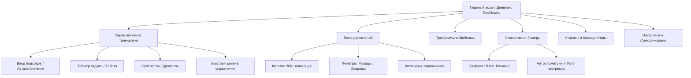
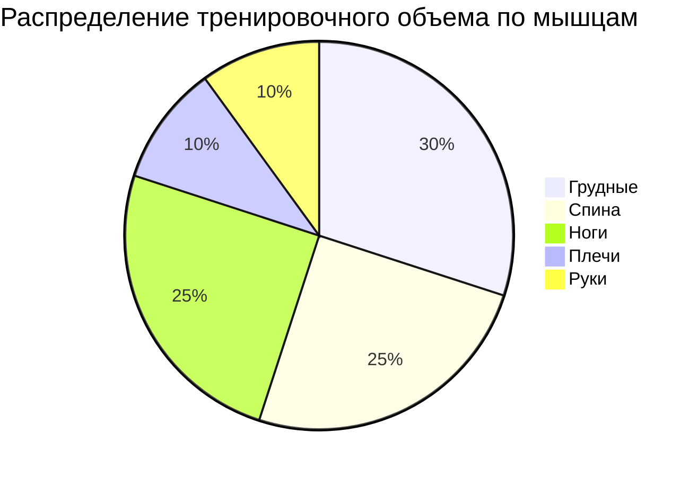

# Полное функциональное и архитектурное описание приложения GymKeeper (Workout Tracker & Planner)

---

## 1. Введение и концепция продукта

**GymKeeper (com.kg.app.sportdiary)** — мобильное приложение для учета силовых и кардио-тренировок, планирования тренировочных программ и анализа прогресса. 

### Ключевые продуктовые принципы (Core Philosophy)
1. **Local-First & Privacy**: Данные хранятся локально на устройстве (SQLite / Room). Не требуется обязательная регистрация, профили в облаке или постоянное интернет-соединение.
2. **Минимизация кликов (Frictionless UX)**: Во время тренировки спортсмен должен тратить минимум времени на взаимодействие с телефоном (в среднем 3–5 секунд между подходами).
3. **Модель монетизации**: Разовая покупка (One-Time Purchase / Lifetime) без принудительной ежемесячной подписки и без рекламы.
4. **Гибкость кастомизации**: Возможность менять структуру упражнений, категорий, программ и переопределять любые дефолтные параметры.

---

## 2. Архитектура экранов и детальный UI/UX

---

### 2.1. Главный экран (Dashboard / Дневник)

Главный экран представляет собой хронологический журнал тренировок с календарной навигацией.

#### Элементы интерфейса (UI Breakdown):
1. **Верхний аппбар (Top App Bar):**
   * **Выбор текущего дневника/клиента**: Дропдаун для быстрого переключения между дневниками (для личного использования или тренерского режима).
   * **Кнопка вызова календаря (Месячный вид)**: Разворачивает полноэкранный календарь (Grid View) с цветовой маркировкой дней:
     * Зеленый/акцентный кружок: Завершенная тренировка.
     * Точка под датой: Запланированная программа.
   * **Иконка поиска / фильтра**: Позволяет искать прошлые тренировки по названию или конкретному упражнению.
2. **Горизонтальная календарная лента (Week Carousel):**
   * Отображает текущую неделю с возможностью бесконечного свайпа влево/вправо.
   * Выделение текущего выбранного дня и отметка сегодняшней даты.
3. **Основной список (Content Area):**
   * **Пустое состояние (Empty State):** Если на выбранный день тренировок нет — отображается мотивирующая иллюстрация, кнопка "Начать тренировку" или напоминание о запланированной по расписанию программе.
   * **Карточки выполненных тренировок:**
     * Название тренировки (например, *«День А: Грудь + Бицепс»*).
     * Время начала, окончания и общая длительность.
     * Общий объем (тоннаж): $\sum (\text{вес} \times \text{повторения})$.
     * Общее количество выполненных подходов и упражнений.
     * Превью списка упражнений: Название, количество подходов и максимальный рабочий вес.
     * Меню карточки (Overflow Menu `...`): *Редактировать*, *Дублировать на другой день*, *Сохранить как шаблон*, *Экспортировать/Поделиться*, *Удалить*.
4. **Кнопка быстрого старта (Floating Action Button - FAB):**
   * Нажатие открывает Bottom Sheet с опциями:
     1. **Пустая тренировка**: Запуск без шаблона.
     2. **Выбрать программу/шаблон**: Открывает список пользовательских и встроенных рутин.
     3. **Повторить последнюю**: Копирование состава предыдущей аналогичной тренировки.

---

### 2.2. Экран активной тренировки (Active Workout Mode)

Центральный экран приложения, оптимизированный под работу в зале.

#### 1. Верхняя панель состояния:
* Поле редактирования названия тренировки.
* Таймер общей длительности (автоматический старт при открытии, возможность паузы).
* Кнопка **«Завершить тренировку»**: Вызывает диалог подтверждения с итоговой сводкой (время, тоннаж, установленные рекорды) и предложением обновить замеры/заметку.
* Кнопка **«Добавить упражнение»** (закреплена внизу или в шапке).

#### 2. Карточка упражнения (Exercise Card):
Каждое упражнение оформлено в виде изолированного интерактивного блока:
* **Заголовок:**
  * Миниатюра анимации техники (клик открывает полноэкранную GIF/видео подсказку).
  * Название упражнения.
  * Кнопка замены упражнения (Quick Swap) — замена текущего движения на альтернативное с сохранением структуры подходов (полезно, если тренажер занят).
  * Меню управления: *Удалить упражнение*, *Добавить в суперсет*, *Добавить заметку к упражнению*, *Посмотреть историю/график этого упражнения*.
* **Таблица подходов (Sets Table):**
  * **Колонки:**
    1. `#` (Порядковый номер подхода).
    2. **Предыдущий результат (Previous / Ghost Data):** Отображает блеклым шрифтом точные данные с прошлой тренировки (например, `80 кг × 8`).
    3. **Вес (Weight):** Поле ввода. Клик открывает кастомный NumPad.
    4. **Повторения (Reps):** Поле ввода количества повторений.
    5. **Метка типа подхода (Set Tag):** Клик по иконке переключает режим:
       * `W` (Warmup) — Разминка (не учитывается в общем рабочем объеме и рекордах).
       * `N` (Normal) — Обычный рабочий подход.
       * `D` (Drop Set) — Дропсет (выполнение без паузы со сбросом веса).
       * `F` (Failure) — Подход до отказа.
    6. **Чекбокс выполнения (Checkmark `✓`):** 
       * Нажатие переводит строку в состояние «Выполнено» (подсвечивается зеленым).
       * **Триггер автозапуска таймера отдыха**: Сразу после отметки чекбокса активируется обратный отсчет отдыха.
* **Добавление / удаление подходов:** Кнопка «+ Добавить подход» дублирует вес и повторения из предыдущей строки. Свайп влево по строке — удаление подхода.

#### 3. Механики суперсетов и круговых тренировок:
* Пользователь может объединить 2 и более упражнений в суперсет / трисет / круг.
* Визуально упражнения объединяются вертикальной цветной скобкой.
* Таймер отдыха запускается только после закрытия последнего подхода всей цепочки суперсета.

---

### 2.3. Встроенный таймер отдыха (Rest & Interval Timers)

1. **Плавающий оверлей / Виджет таймера:**
   * Отображается поверх интерфейса во время активного отдыха.
   * Визуальный круговой прогресс-бар и текстовый обратный отсчет (мм:сс).
   * Кнопки быстрой коррекции времени: `+30s`, `+15s`, `-15s`, `Skip / Пропустить`.
2. **Фоновая работа и уведомления:**
   * Работает в фоне через Android Foreground Service / iOS Live Activity.
   * Звуковой сигнал (настраиваемый тон/бип) за 3 секунды до конца и финальный сигнал.
   * Тактильная отдача (вибрация разной интенсивности).
   * Управление таймером прямо из системной шторки уведомлений / Apple Watch / Wear OS.
3. **Режим Табата / Интервальный таймер (Tabata & HIIT):**
   * Отдельный настраиваемый пресет: Время работы (Work), Время отдыха (Rest), Количество раундов (Rounds), Количество циклов (Cycles), Отдых между циклами (Cool Down).

---

## 3. База упражнений и Программы тренировок

### 3.1. Каталог упражнений (Exercise Library)
* **Встроенная база (300+ упражнений):**
  * Векторные / GIF анимации правильной биомеханики.
  * Анатомическая карта задействованных мышц (Основные / Второстепенные).
  * Текстовая инструкция по выполнению и частые ошибки.
* **Система фильтрации и категоризации:**
  * **По мышечным группам:** Грудные, Широчайшие, Трапеции, Поясница, Квадрицепсы, Бицепс бедра, Икры, Передняя/Средняя/Задняя дельта, Бицепс, Трицепс, Предплечья, Пресс/Кор, Кардио, Все тело.
  * **По типу снаряда/оборудования:** Штанга, Гантели, Блочные тренажеры (Кроссовер), Рычажные тренажеры (Hammer), Собственный вес, Гравитрон, Фитнес-резинки / Эспандеры, Гири, Смит-машина, TRX / Петли.
  * **По типу механики:** Базовые (многосуставные), Изолирующие.
* **Кастомные упражнения (User-Created):**
  * Возможность создания своего упражнения с выбором категории, единиц измерения (кг / фунты, повторения / секунды / дистанция в км), добавлением собственных заметок и фотографий.

### 3.2. Конструктор программ (Routine Planner)
* **Встроенные профессиональные программы (20+):**
  * *Силовые циклы:* 5x5 Stronglifts, Starting Strength, Метод Техасского цикла, Схема 5/3/1 Вендлера.
  * *Бодибилдинг сплиты:* Classic Bro-Split (3–5 дней), Push / Pull / Legs (PPL), Верх / Низ (Upper / Lower), Full Body (3 раза в неделю).
  * *Домашние тренировки:* Тренировки с резинками, с гантелями, воркаут с собственным весом.
* **Пользовательские шаблоны:**
  * Иерархия: *Папка программы → Тренировочные дни (День А, День Б) → Список упражнений с предустановленными целевыми подходами и диапазонами повторений*.
  * Возможность делиться шаблонами через глубокие ссылки (Deep Links) или текстовый экспорт.

---

## 4. Аналитика, Статистика и Прогресс

### 4.1. Статистика упражнений и силовых показателей
* **Расчет 1RM (One Rep Max - Одноповторный максимум):**
  * Динамический расчет максимального теоретического веса на 1 повторение по формулам Эпли ($1RM = w \cdot (1 + \frac{r}{30})$) и Бржицки ($1RM = w \cdot \frac{36}{37 - r}$).
  * График изменения 1RM во времени.
* **Тоннаж и объемы:**
  * График совокупного объема за тренировку / неделю / месяц.
  * График максимального поднятого веса за подход.
* **История личных рекордов (PRs - Personal Records):**
  * Автоматическая фиксация рекордов: *Максимальный вес*, *Максимальный объем в одном подходе*, *Максимальный объем за всю тренировку*. При взятии рекорда выдается поздравительный бейдж.

### 4.2. Дневник замеров тела (Body Tracker)
* **Параметры для отслеживания:**
  * Масса тела, Процент подкожного жира, ИМТ (BMI).
  * Обхваты: Шея, Плечи, Грудь, Бицепс (левый/правый), Предплечье, Талия, Живот, Бедра, Бедро (левое/правое), Голень/Икра.
* **Визуальный трекер фото (Progress Photos):**
  * Фотоальбом «До / После» с фильтрацией по датам и ракурсам (Спереди, Сбоку, Сзади).
  * Наложение сетки и полупрозрачного силуэта для точного повторения позы.

---

## 5. Встроенный инструментарий (Calculators & Utilities)

1. **Калькулятор блинов для штанги (Plate Loading Calculator):**
   * Ввод целевого веса штанги (например, 142.5 кг).
   * Выбор веса грифа (20 кг олимпийский, 15 кг женский, 10 кг EZ-гриф).
   * Выбор доступного набора блинов в зале (25, 20, 15, 10, 5, 2.5, 1.25, 0.5 кг).
   * Графическая визуализация: Схема надевания блинов на гриф с каждой стороны.
2. **Калькулятор одноповторного максимума (1RM Calculator):**
   * Таблица расчетов процента от 1RM (от 50% до 100%) с шагом 5% (удобно для построения процентовки в пауэрлифтинге).
3. **Калькуляторы метаболизма и пульса:**
   * BMR (Basal Metabolic Rate) по формуле Миффлина — Сан Жеора и Харриса — Бенедикта.
   * TDEE (Total Daily Energy Expenditure) с учетом уровня физической активности.
   * Пульсовые зоны для кардио по формуле Карвонена (Зона разминки, жиросжигания, аэробная, анаэробная, VO2 Max).

---

## 6. Настройки, Данные и Системная интеграция

### 6.1. Управление данными и Синхронизация
* **Локальная база данных (Local-first):** Все изменения мгновенно пишутся в локальную БД.
* **Резервное копирование (Google Drive / iCloud):**
  * Автоматический бэкап при завершении тренировки или подключении к Wi-Fi.
  * Ручное создание снимка БД (`.backup` / `.db`).
* **Экспорт / Импорт:**
  * Экспорт всей истории в `.CSV` (структурированная таблица для анализа в Excel / Python) и `.TXT`.
  * Импорт данных из других популярных трекеров (Strong, Hevy, FitNotes).
* **Интеграция со службами здоровья:**
  * Google Fit / Health Connect (Android).
  * Apple Health (iOS).
  * Передача данных: Сожженные активные калории, время тренировки, тип активности, ЧСС (если подключен пульсометр).

### 6.2. Кастомизация интерфейса
* **Темы оформления:**
  * Светлая тема.
  * Темная (Dark Gray) тема.
  * AMOLED Pure Black (абсолютно черный фон для экономии энергии на OLED экранах).
* **Поведение автозаполнения (Smart Autofill):**
  * *Режим 1:* Подставлять точные значения прошлой тренировки.
  * *Режим 2:* Оставлять поля пустыми с отображением подсказки серым цветом.
  * *Режим 3:* Автоматически увеличивать вес на шаг прогрессии (+2.5 кг).
* **Единицы измерения:**
  * Килограммы (кг) / Фунты (lbs).
  * Сантиметры (см) / Дюймы (in).
  * Километры (км) / Мили (mi).

### 6.3. Тренерский режим (Multi-Profile / Trainer Mode)
* Возможность переключения профилей внутри одного инстанса приложения.
* Независимые журналы, шаблоны и замеры для каждого подопечного/клиента.

---

## 7. Сводная матрица фич (Feature Matrix)

| Функциональный блок | Бесплатная версия (Free) | Полная версия (Pro / Lifetime) |
| :--- | :--- | :--- |
| **База упражнений (300+)** | Доступна полностью | Доступна полностью |
| **Создание кастомных упражнений** | До 3-5 упражнений | Без ограничений |
| **Шаблоны тренировок** | До 3 активных рутин | Без ограничений |
| **Таймер отдыха и Табата** | Базовый таймер | Полная кастомизация сигналов/интервалов |
| **История тренировок** | Полная | Полная |
| **Расширенная аналитика и 1RM** | Ограничена базовыми графиками | Все графики, тренды и расчеты |
| **Калькулятор блинов и метаболизма** | Базовый | Все калькуляторы |
| **Экспорт в CSV / Бэкап в облако** | Ручной локальный | Автоматический в Google Drive/iCloud |
| **Реклама / Подписки** | Отсутствует | Отсутствует (Разовая покупка) |
